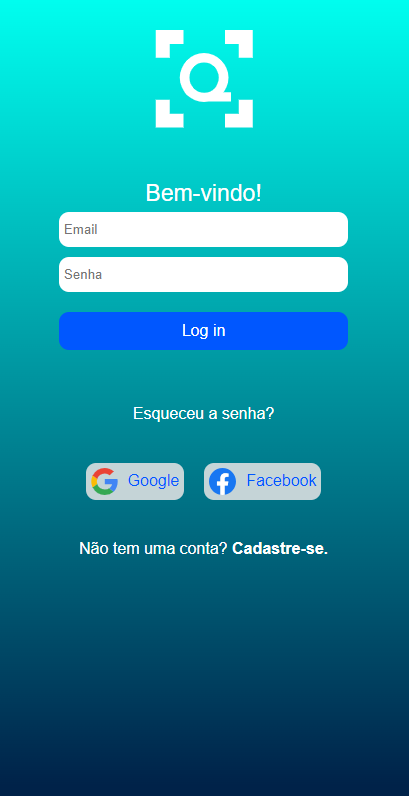
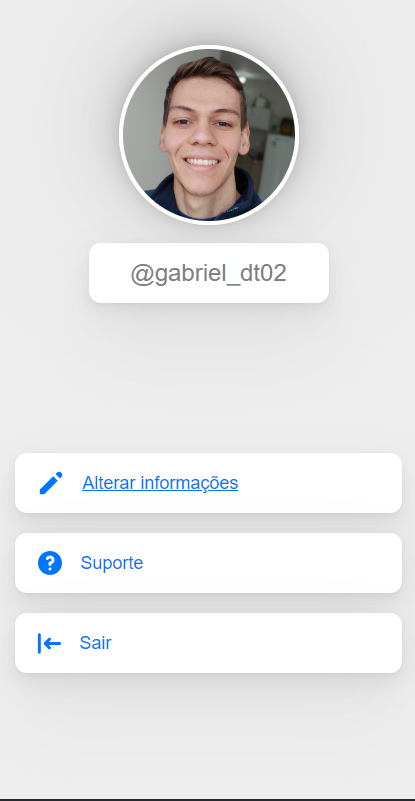

# Mobile Application Project

These two pages represent a mobile application developed for a college assignment. The main idea of this project was to create a mobile application to address issues related to queues in stores, so the customer could buy the stuff using their phone and scan a QR code or a barcode to pay for the products, and skip the queues. 
  
You can check the project repository by clicking  => [here](https://github.com/AndryelBlanco/NoQueue) <=, this repo is just to showcase these two screens, that are part of my contribution to the project.
  
# Login page
  
[Click to view the No Queue Login Page](https://gabrieldinecktremarin.github.io/noqueue-profile-page-and-login-page/login-page/index.html)
 

# Profile page
  
[Click to view the No Queue Profile Page](https://gabrieldinecktremarin.github.io/noqueue-profile-page-and-login-page/profile-page/index.html)

